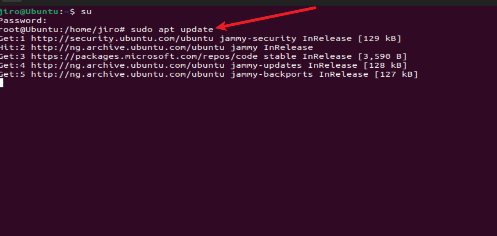

# Linux Project Implementation

In this project, we will be implementing some basic linux commands

## Sudo command

The sudo command is also known as super user do command, which, is used to grant administrative  privileges to a certain user to manipulate root files and folders.

To use the sudo command, we use the following syntax `sudo apt upgrade`

